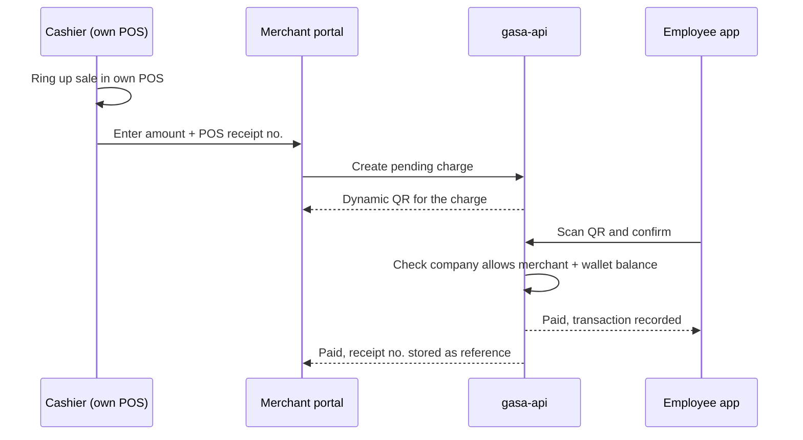
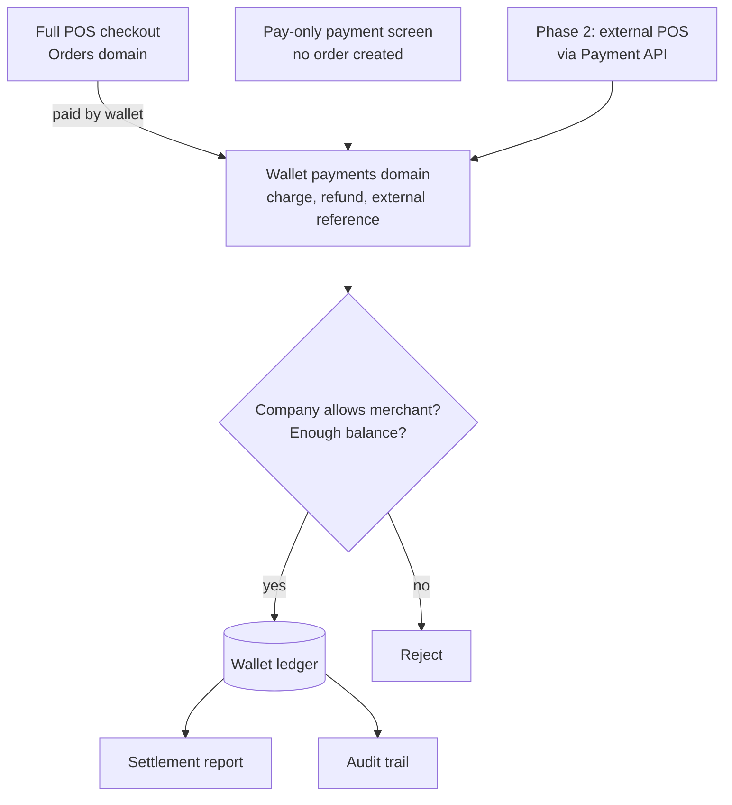
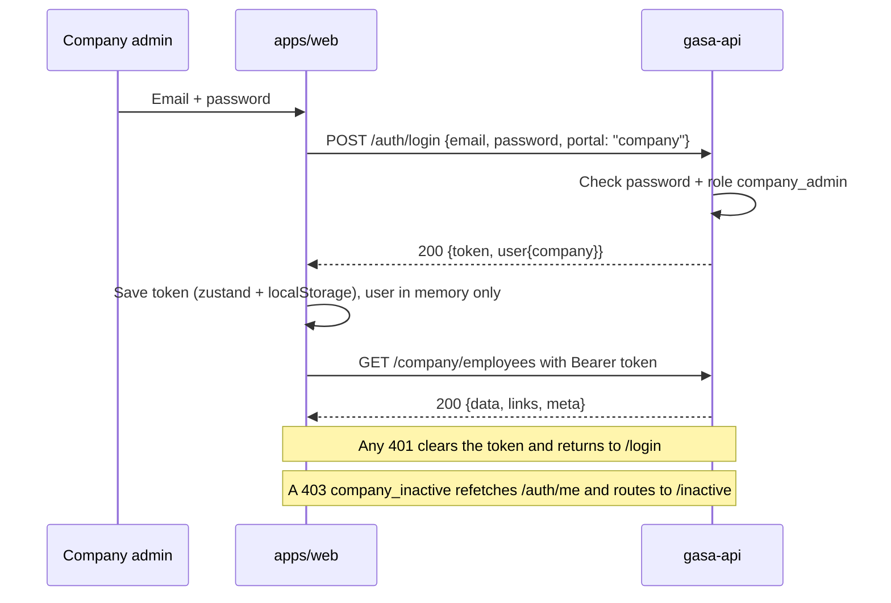

# HANDOFF: Gasa workspace

- **Last updated:** 2026-09-16
- **Previous session:** started in `E:\Desktop\company-portal`, continuing in `E:\Desktop\gasa`
- **Location:** `E:\Desktop\gasa\company-portal\docs\tasks\HANDOFF.md`. Moved out of the gasa root on 2026-09-11 (`ai-core/08` FILE PLACEMENT RULE), so it is committed with company-portal and shared with the team.

---

## Current state

| Item | State | Pending |
|---|---|---|
| Last sync (`ai-core/08` SYNC RULE) | 2026-09-16 02:17 +08:00, right before the commits below. gasa-api `main` @ `69be9c4` (P10, section 4.2), unchanged since 00:54 | Sync again at the next session start |
| Working branch (`ai-core/08` BRANCH RULE) | `dev-dean` in both repos. company-portal: `main` and `dev-dean` both pushed. gasa-api: `dev-dean` has 2 local commits, push denied (Q14). merchant-portal untouched, on `main` | Q10: was merchant-portal meant too? |
| gasa-api: Company domain + employee roster | **Committed on `dev-dean` 2026-09-16: `966e1ac` (domain) + `7ffbe60` (seeders). NOT pushed: GitHub returned 403 for `dinmaku` on `swiftlyph/gasa-api`** (section 4.3). Pint, Larastan and Pest pass locally (490 passed on the rerun; the only failure is the Redis-only health check) | Q14: write access, then `git push -u origin dev-dean` and open the PR `dev-dean` -> `main` |
| Local environment | gasa-api `.env` (git-ignored) has the local Postgres credentials and file/sync drivers (no Redis on this machine); databases `gasa` (migrated + seeded) and `gasa_api_test` exist. Both apps ran and were smoke-tested end to end on 2026-09-16 (section 11) | None |
| company-portal: login, shell, dashboard, Employees | **Pushed 2026-09-16: `main` @ `34a7303` (3 commits: scaffold, feature, docs), GitHub's default branch; `dev-dean` pushed from the same commit** (section 7). `build`, `lint`, `test` (26), `typecheck` pass. `CLAUDE.md` added (no AI attribution, like the other repos) | New commits go on `dev-dean` and reach `main` by PR |
| Staging evidence account | `StagingCompanySeeder` (section 4.3), manual, not yet run anywhere | Run on staging after the gasa-api PR merges |
| Workspace `E:\Desktop\gasa` | Set up. We only work in company-portal and gasa-api (`ai-core/08`) | None |
| Old `E:\Desktop\company-portal` | Duplicate of `gasa/company-portal` (verified identical on 2026-09-11) | User deletes it after reopening VS Code at `E:\Desktop\gasa` |
| Merchant integration approach | Recommended (section 5) | Team and API owner sign-off |
| Jira tickets | None yet | None |

### Resume checklist (next session)

1. Load `company-portal/ai-core/00-agent.md` and the modules 01 to 08 it references.
2. Sync company-portal and gasa-api (`ai-core/08` SYNC RULE), confirm both are on `dev-dean`, then update the "Last sync" row.
3. Read this file top to bottom.
4. Run the gasa-api suite (section 11) after any gasa-api change; the local databases are ready.
5. Answer the open questions in section 9, then continue.

---

## 1. Project briefing

Gasa is an employee-benefits system. A company loads points/allowance into each employee's e-wallet/card, and employees spend it at merchants. Merchants use Gasa as a mini in-tenant POS for those transactions. The scope below is the MVP; more features will follow.

| Portal | Users | MVP scope |
|---|---|---|
| Platform / System Admin | Gasa staff | Controls companies, merchants, user management (RBAC) |
| Company | Company HR / admin | Employee CRUD + points management; pick which merchants to include/exclude; basic HRIS (payroll) |
| Merchant | Merchant owner / staff | POS, staff management (RBAC), kitchen queues, orders, inventory |
| Employee | Employees | Digital ID, wallet, transactions, pay |

- Every portal has an audit trail.
- **We own the company portal.** `gasa-api` is shared with the other teams.
- Repos that exist today: `gasa-api`, `merchant-portal`, `company-portal`. Admin and employee portal repos are not created yet.
- Task board cards for the company portal (2026-09-16): **Employee Management** (In Progress, assigned to Dean), **Merchants**, **Starter HRIS**, **Audit Trail** (Company, Employee, Merchant, Platform).

---

## 2. Workspace

```text
E:\Desktop\gasa                  local workspace only, NOT a git repo
├── company-portal/              -> github.com/swiftlyph/company-portal.git   (ours)
│   └── docs/tasks/HANDOFF.md    this file
├── gasa-api/                    -> github.com/swiftlyph/gasa-api.git         (we change it, shared with other teams)
└── merchant-portal/             -> github.com/swiftlyph/merchant-portal.git  (read-only reference)
```

Logo images that were in the gasa root (`gasa.png`, `gasa-icon.png`, `Gemini_Generated_Image_*`) are now in `E:\Desktop\archive\gasa_arch\` (as of 2026-09-11). `letter-g.png` was not found on the Desktop.

Rules (full text in `company-portal/ai-core/08-workspace-rules.md`):

- Only work in `company-portal/` and `gasa-api/`. Don't modify, install, build or run git in any other folder unless the user asks for that task.
- Every new file goes in `company-portal/`. Nothing is added to the gasa root.
- Pull both repos at session start, every 8 hours, and before branching, committing or pushing.
- Work on `dev-dean` in both repos. Never commit on `main`; `main` only moves by sync or by a merged PR.
- Never `git init` the gasa root. Run git inside each repo; each pushes/pulls to its own remote.
- Open `E:\Desktop\gasa` in VS Code; Source Control lists all 3 repos.

| Repo | Stack | Branch @ HEAD | Repo rules |
|---|---|---|---|
| gasa-api | Laravel 12, PHP ^8.2 (8.5 locally), Vite 7, Tailwind 4, PHPStan, Pest | `dev-dean` @ `7ffbe60`, two local commits ahead of `main` @ `69be9c4`, not pushed (Q14) | `CLAUDE.md`: no Co-Authored-By or AI attribution in commits; one commit per logical feature |
| merchant-portal | React 18, TypeScript 5.6, Vite 5, Tailwind 4, shadcn (`components.json`), Vitest | `main` @ `252770c` (PR #10: F11 receipt + shift report printing), checked 2026-09-11 | `CLAUDE.md`: no Co-Authored-By or AI attribution in commits; has `.claude/commands/` |
| company-portal | React 19, TypeScript ~6, Vite 8, Tailwind 4, shadcn 4 (Base UI), Turborepo 2 + npm workspaces, Vitest 4 | `main` @ `34a7303` pushed (GitHub default); `dev-dean` pushed, ahead of `main` by the handoff commits | `CLAUDE.md`: no Co-Authored-By or AI attribution in commits |

gasa-api remote branches: `main`, `staging` (same commit as `main`), `feat/orders-domain`, `feat/p5-admin-provisioning`, `feat/p6`, `feat/p8-permissions`, `feat/p9-shift-report-receipt`.

### 2.1 company-portal layout

Scaffolded 2026-09-11 with `npx shadcn@latest init --preset b2trRXeawq --template vite --monorepo --pointer`; app code added 2026-09-16 (section 7).

```text
company-portal/
├── ai-core/                agent rules (00 to 08)
├── docs/tasks/             HANDOFF.md (this file)
├── README.md               how to run, check, and add components
├── apps/web/               the portal; `@/` -> apps/web/src
│   ├── .env.example        VITE_API_URL=http://localhost:8001/api/v1 (copy to .env.local)
│   ├── vite.config.ts      port 5174 strictPort; Vitest (jsdom) config
│   └── src/
│       ├── app/            app.tsx, providers.tsx (QueryClient, auth boot gate), router.tsx, dashboard-layout.tsx
│       ├── components/     app-sidebar, nav-main, nav-user, theme-toggle, toaster, full-screen-loader, placeholder-page
│       ├── features/       auth/, company/, dashboard/, employees/ (api, types, hooks, pages, components, tests)
│       ├── lib/api/        client.ts (fetch wrapper), types.ts
│       └── pages/          not-found.tsx
├── packages/ui/            shared shadcn (Base UI) components + hooks + globals.css, imported as `@workspace/ui/*`
├── turbo.json              build, dev, lint, format, typecheck, test
└── package.json            npm workspaces (apps/*, packages/*)
```

| Task | Command (from `company-portal/`) |
|---|---|
| Install | `npx -y npm@11 install` (see the npm note below) |
| Dev server | `npm run dev` (http://localhost:5174, pinned) |
| Build / lint / typecheck / test | `npm run build`, `npm run lint`, `npm run typecheck`, `npm run test` |
| Single workspace | `npm run test -w web`, `npm run lint -w web` |
| Add a shadcn component | `cd apps/web && npx shadcn@latest add <component>` (files land in `packages/ui`; move any hook the CLI writes to `apps/web/src/hooks` into `packages/ui/src/hooks`) |

**npm note (2026-09-16):** the machine's npm 10.9 crashes with `Cannot read properties of null (reading 'edgesOut')` on this tree (an arborist bug in its peer-set resolver, triggered once Vitest 4 was added). `npx -y npm@11 install` works and writes a normal lockfile; every other `npm run ...` command is fine on 10.9. Upgrading the global npm (`npm install -g npm@11`) would also fix it; not done, since it is the user's machine.

shadcn settings (`apps/web/components.json`): style `base-luma`, base color `neutral`, icons `lucide`, pointer cursor on buttons. Fonts: Manrope and Outfit. Base UI components take a `render` element where Radix took `asChild`.

---

## 3. Agent rules (`company-portal/ai-core/`)

| File | Purpose |
|---|---|
| `00-agent.md` | Entry point: module list, priority, workspace rule, ticket-state rule (`company-portal/docs/tasks/HANDOFF.md`), doc rule, output rule |
| `01-senior-dev.md` | Simple, maintainable, minimal changes; ask only when blocked |
| `02-skill-router.md` | Classify the task: planning / coding / debugging / refactoring / testing |
| `03-execution-loop.md` | Execution steps + SEEDER RULE (manual idempotent `Staging*Seeder`, users by email, never destructive) |
| `04-output-rules.md` | Concise output; EM DASH RULE (no mid-sentence em dashes, only as label separators) |
| `05-task-types.md` | Feature / bug / refactor / unknown task flows |
| `06-document-analysis.md` | Mandatory Mermaid diagrams for architecture and flows |
| `07-document-standard.md` | Doc structure: rationale, validation, risks, file impact |
| `08-workspace-rules.md` | Always active: SCOPE RULE (only company-portal + gasa-api), FILE PLACEMENT RULE (new files in company-portal), BRANCH RULE (work on `dev-dean`, never commit on `main`), SYNC RULE (sync at session start, every 8 hours, before branch/commit/push) |

Known issue: `06-document-analysis.md` is truncated. It ends inside the Mermaid example, so the code block is never closed.

---

## 4. gasa-api findings

Read-only inspection on 2026-09-10, 2026-09-11 and 2026-09-16, then the Company domain build on 2026-09-16 (section 4.3).

- **Domains:** `app/Domains/{Auth, CashSessions, Catalog, Company, Merchant, Orders, Platform, Shared}`
- **Routes per audience:** `routes/api/v1/{admin, auth, company, employee, merchant, public}.php`
- **Merchant routes:** behind `auth:sanctum` + `role:merchant` + `EnsureMerchantActive`. Tenant-scoped through the `BelongsToMerchant` global scope, so another merchant's id returns 404 (not 403). The merchant always comes from `$user->merchant()`, never from the URL.
- **Orders:** counter-service model. Payment happens at creation; there is no unpaid state.
- **`PaymentMethod` enum** (`app/Domains/Orders/Enums/PaymentMethod.php`): `cash`, `gcash`, `split`. Adding a case requires a migration widening the `orders.payment_method` CHECK constraint. `split` requires `cash_cents` + `gcash_cents` = `total_cents`.
- **No wallet/points payment exists yet.** This is the core Gasa flow, and every portal depends on it.
- **Kitchen queue:** read-only view over pending orders, polled (no websockets). Status changes only go through the order transition endpoints.
- **Checkout** is idempotent (`IdempotentCheckoutAction`, `CheckoutFingerprint`).
- **`Merchant` model:** profile fields + `status`. No mode or enabled-modules field yet.
- **Conventions that matter for us** (README "Conventions"): thin controllers, FormRequest validation, writes through Actions, Policies for authorization, output through Resources, error shape `{ message, code, errors? }`, single resources flat, paginated lists `{ data, links, meta }`, money in cents. Tests are Pest against real PostgreSQL (`gasa_api_test`), never sqlite.

### 4.1 Auth contract (read 2026-09-11)

- **Bearer tokens only.** Sanctum personal access tokens. `config/cors.php` has `supports_credentials: false` and no stateful domains; `sanctum.guard` is `[]`. Allowed origins come from the comma-separated `FRONTEND_ORIGINS` env var (default `http://localhost:5173`).
- **Login:** `POST /api/v1/auth/login` (throttled), body `{ email, password, portal }`. `portal` is one of `admin`, `company`, `employee`, `merchant`. The company portal sends `portal: "company"`, which requires role `company_admin` (`config/portals.php`).
  - `200 { token, user }` (user includes `roles`, `merchants`, and since 4.3 `company`)
  - `401 invalid_credentials`, `403 portal_forbidden`
- **Session:** `GET /api/v1/auth/me`, `POST /api/v1/auth/logout` (revokes the current token).
- **Token lifetime:** `sanctum.expiration` is `null`, so tokens never expire server-side.

### 4.2 P10: statutory tax + beneficiary discounts (pulled 2026-09-16)

One commit, `69be9c4`, 40 files. Nothing changed on our surface. Philippine VAT and senior/PWD discounts in `config/merchant.php` + `Orders/Support/StatutoryTax.php`; `merchants.vat_registered`; `OrderBeneficiary`; tax fields on checkout/receipt/reports. New `.github/workflows/deploy.yml` deploys `main` to staging over SSH once CI passes (`migrate --force`, config/route/view cache), so a merge to `main` is a staging deploy (TICKET STATE RULE).

### 4.3 Company domain + employee roster (built 2026-09-16, `dev-dean`, uncommitted)

Built as the Merchant domain's twin so it merges without friction (user direction 2026-09-16: "follow what gasa-api has"). README section "Company & employees" documents it in the API's own voice.

**Endpoints** (`routes/api/v1/company.php`, group `company.api` = `auth:sanctum` + `role:company_admin` + `EnsureCompanyActive`):

| Method | Route | Notes |
|---|---|---|
| `GET` | `/api/v1/company/profile` | The caller's own company, flat |
| `GET` | `/api/v1/company/employees` | Paginated `{ data, links, meta }`; `?status=`, `?search=` (name, email, employee no.), `?per_page=` ≤ 100; ordered last name, first name, id |
| `POST` | `/api/v1/company/employees` | `{ first_name, last_name, email, employee_no?, mobile?, department?, job_title?, hired_at? }` → 201 flat |
| `GET` | `/api/v1/company/employees/{employee}` | Flat |
| `PATCH` | `/api/v1/company/employees/{employee}` | Partial; same fields plus `status` (`active` \| `inactive`) |
| `DELETE` | `/api/v1/company/employees/{employee}` | Soft delete; `200 { message, code: "employee_removed" }` |
| `GET` | `/api/v1/company/whoami` | Kept, like the other portal files |

**Decisions and why:**

| Decision | Why |
|---|---|
| Company membership is `users.company_id` (FK added now), not a pivot | The column has existed since the first migration with the comment "FK to companies added in the tenancy phase"; a user belongs to exactly one company |
| `User::company()` (relation, any status) + `User::activeCompany()` (active only, memoized) | Twin of `merchants()` + `merchant()`; `/auth/me` shows a suspended company's status while tenancy and `EnsureCompanyActive` use the active-only resolver |
| `BelongsToCompany` trait mirrors `BelongsToMerchant` line for line | `BelongsToMerchant`'s docblock asked for exactly this twin |
| `EnsureCompanyActive` → `403 company_inactive` on every `/company/*` route, in the priority list before `SubstituteBindings` | Same reasoning as `EnsureMerchantActive` |
| An employee is an HR record, NOT a login: `employees.user_id` stays null | No invite system for companies yet, and the employee portal repo doesn't exist; mirrors the merchant order (profile first, team after). `has_account` is on the payload already |
| `email` and `employee_no` unique per company among non-deleted rows (Postgres partial unique indexes); email lowercased on write | The same person can be on two rosters; a rehire can reuse both values |
| Uniqueness checked in the Actions, not FormRequests: `422 employee_email_taken` / `422 employee_number_taken`, field named in `errors` | The API's rule (see `AddTeamMemberRequest`); naming the collision is safe inside the caller's own roster |
| Employees soft-delete; `DELETE` returns a 200 body | A future wallet ledger will reference them; the API never returns a bare 204 |
| `CompanyStatus` (`pending`/`active`/`suspended`) with no transition map yet; no `POST /admin/companies` | Nothing moves the status except seeders this phase; the platform-admin provisioning phase adds both, mirroring merchants |
| No permission catalog for companies | Single role (`company_admin`); `CompanyPolicy`/`EmployeePolicy` check ownership only |

**Files:** migrations `2026_09_16_000000_create_companies_table`, `000100_add_company_foreign_key_to_users_table`, `000200_create_employees_table`; `app/Domains/Company/{Enums/CompanyStatus, Enums/EmployeeStatus, Models/Company, Models/Employee, Actions/{Create,Update,Delete}EmployeeAction, Exceptions/Employee{Email,Number}Taken, Http/Middleware/EnsureCompanyActive, Http/Controllers/{CompanyProfile,Employee}Controller, Http/Requests/{Index,Store,Update}Employee(s)Request, Http/Resources/{CompanySummary,CompanyProfile,Employee}Resource, Policies/{Company,Employee}Policy}`; `app/Domains/Shared/Concerns/BelongsToCompany`; `database/factories/{Company,Employee}Factory`; `database/seeders/StagingCompanySeeder`; edits to `User`, `UserResource` (+`company`), `AuthController`/`AcceptInviteController` (eager-load `company`), `bootstrap/app.php`, `routes/api/v1/company.php`, `DevSeeder`, `README.md`; tests `tests/Feature/Company/{Profile,Employee}Test.php`, a COMPANIES block appended to `TenantLeakageTest`, `WhoamiTest` gives `company_admin` an active company.

**Seed data:** `DevSeeder` adds `company2@gasa.test` / `password` (Company Two) alongside `company@gasa.test` (Company One), both active with rosters; `employee@gasa.test` is linked to Company One's "Maria Santos" row (`has_account: true`). `StagingCompanySeeder` (manual, SEEDER RULE): `STAGING_SEED_PASSWORD='<choose>' php artisan db:seed --class=StagingCompanySeeder --force` creates `company.staging@gasa.test` (role `company_admin`, company "Staging Company", active, five employees). Idempotent by email.

**Verification status (2026-09-16):** `composer lint` (Pint) passes; `./vendor/bin/phpstan analyse --memory-limit=1G` passes with no errors (the default 128M limit crashes the parallel worker, hence the flag); `php artisan route:list --path=api/v1/company` shows the 7 routes; `php artisan migrate --seed` ran cleanly on local PostgreSQL 17 (the partial unique indexes and CHECK constraints included). `composer test`: first run **489 passed, 2 failed**, rerun **490 passed, 1 failed**; neither failure is in the Company work: `HealthTest` expects `redis: ok` and this machine has no Redis (CI runs one), and `ZReportTest`'s bounded-query-count case reported 18 vs 17 in the full run but passes in isolation both with our changes and on pristine `main` (verified by stashing the work), so it is order-dependent flakiness in that pre-existing test. Smoke-tested live (section 11): login with the `company` block, profile, employee search, `portal_forbidden` for a merchant account, CORS preflight from 5174. Local `.env` and `.env.example` also gained `http://localhost:5174` in `FRONTEND_ORIGINS`.

**Follow-ups for later phases:** employee invites into the employee portal (needs a company-side invitation table or a generalised `team_invitations`), `POST /admin/companies` + status transitions, audit log entries for company-admin actions (the Audit Trail card), a company permission catalog, `PATCH /company/profile`.

---

## 5. Merchant integration recommendation

Status: **proposed, not agreed.** Answers: "How do we onboard merchants that already have their own POS / inventory system?"

### Approach

Gasa payment acceptance is the one thing every merchant uses. POS, kitchen queue, inventory and staff management become optional modules, toggled per merchant.

| Mode | For | Uses in Gasa |
|---|---|---|
| Full POS | Merchants with no system | POS, kitchen queue, orders, inventory, staff, payments |
| Pay-only | Merchants with their own POS | Payment screen, transactions, settlement report, staff, audit trail |
| API integration (phase 2) | Merchants whose POS vendor will integrate | Gasa as a payment option inside their own POS |

### Pay-only flow (MVP)



- Alternative at step 5: the cashier scans the employee's QR from their Digital ID.
- Merchants reconcile against their own POS with a daily settlement report (CSV).

### Target architecture



### Implementation notes for gasa-api (needs API team agreement)

1. New wallet payments domain, separate from `Orders`: ledger, charges, refunds, external reference. One place for all wallet money in every mode.
2. Add a wallet case to `PaymentMethod` (plus the migration widening the CHECK constraint) so full-POS checkout can take wallet payments.
3. Every charge checks the employee's company include/exclude merchant list (managed in our company portal) and the wallet balance.
4. Add a mode or enabled-modules field on `Merchant`, set by Platform Admin at onboarding. Enforce it in the API (middleware), and have merchant-portal hide disabled screens.
5. Phase 2 Payment API: per-merchant API keys, create/refund charge, webhooks, idempotency keys (reuse the `IdempotentCheckoutAction` pattern).

### Out of scope for MVP

- Syncing menus or inventory with external systems. It creates two sources of truth and a connector to maintain per POS vendor. Gasa only needs the amount, reference and merchant.

---

## 6. company-portal API client

Status: **implemented 2026-09-16** (no axios). `apps/web/src/lib/api/client.ts` is merchant-portal's fetch wrapper with the merchant hooks replaced by `registerOnCompanyInactive`. TanStack Query holds all server state; zustand holds the token.

Axios and Sanctum are not alternatives. Sanctum is the API's auth layer: it issues and checks the token. The frontend still needs an HTTP client to send requests with that token, and the API is Bearer-only (no XSRF cookies), so axios's Laravel perk is unused. Revisit axios only if a feature needs upload progress (for example a bulk employee CSV import with a progress bar).

### Request flow



---

## 7. company-portal app (built 2026-09-16, `dev-dean`, uncommitted)

Follows merchant-portal's structure and conventions (features folder, fetch client, zustand auth store, TanStack Query, URL-driven list filters, additive-tolerant parsers), adapted to React 19 + Base UI shadcn.

```mermaid
flowchart TD
    B[Boot: token in localStorage?] -->|no| L[/login]
    B -->|yes| M[GET /auth/me]
    M -->|401| L
    M -->|ok| G{company.status active?}
    L -->|login ok| G
    G -->|no| I[/inactive: pending, suspended or no company]
    G -->|yes| S[/app shell: sidebar + breadcrumb]
    S --> D[/app/dashboard]
    S --> E[/app/employees]
    S --> P[/app/merchants, /app/hris, /app/audit-trail: placeholders]
    E --> F[Add / edit dialog]
    E --> R[Remove confirm]
```

| Route | What exists |
|---|---|
| `/login` | Email + password, `portal: "company"`; field errors, invalid-credentials and portal-forbidden messages, 60s cooldown on 429, session-expired notice |
| `/inactive` | Copy for no company / pending / suspended, log out |
| `/app/dashboard` | Company name (profile), employee totals (all, active) from the list meta, links to Employees and the coming-soon sections |
| `/app/employees` | Search (name, email, employee no.), status filter, server pagination, add/edit dialog (all fields, status on edit only), remove confirm, toasts. Filters live in the URL |
| `/app/merchants`, `/app/hris`, `/app/audit-trail` | Placeholder pages ("This section is coming soon") so the nav is complete |
| `*` | 404 |

Tests (Vitest 4 + Testing Library, 26 passing): API client, auth store, employees API parsing, employees page (list, URL filters, empty, error, add and edit dialogs).

Not done: employee detail page, CSV import, sorting controls, the three placeholder sections, a `CLAUDE.md`, a CI workflow for company-portal (merchant-portal's `.github` can be copied when the repo is first pushed).

---

## 8. Session log

| Date | What happened |
|---|---|
| 2026-09-10 | Loaded `ai-core` rules. Received the Gasa briefing. |
| 2026-09-10 | Used the existing `E:\Desktop\gasa` folder (only logo images) as the root. Cloned `gasa-api` and `merchant-portal`. Copied `company-portal` in (copy, not move, because VS Code and the session had it open). Verified remotes. |
| 2026-09-10 | Read gasa-api domains, routes and `PaymentMethod`. Gave the merchant integration recommendation (section 5). |
| 2026-09-11 | Wrote this handoff. Seeded Claude memory for the gasa workspace path. |
| 2026-09-11 | Loaded `ai-core` rules and this handoff. Ran the shadcn init (section 2.1) in the Claude scratchpad, copied the result into company-portal without its own `.git` and `node_modules`, then ran `npm install` (0 vulnerabilities) and `npm run build` (passes). |
| 2026-09-11 | Read the gasa-api auth contract (login, portals, CORS, Sanctum) and merchant-portal's API client. Recommended no axios (section 6). |
| 2026-09-11 | User set workspace rules: only touch company-portal and gasa-api, every new file goes in company-portal, pull at session start and every 8 hours. Added `ai-core/08-workspace-rules.md`, updated `00-agent.md`, moved this file from the gasa root into `company-portal/docs/tasks/`. First pull under the new rule: gasa-api already up to date. Deleted the scratchpad scaffold copy. |
| 2026-09-16 | User reported a new gasa-api push. Pulled both repos (SYNC RULE): gasa-api `668c37e` -> `69be9c4` (P10, section 4.2); company-portal remote still empty. No files changed by us. |
| 2026-09-16 | User asked for a `dev-dean` branch on all repos as our workspace. Synced, then created and checked out local `dev-dean` in company-portal and gasa-api (not pushed). Skipped merchant-portal under the SCOPE RULE (Q10). Added the BRANCH RULE to `ai-core/08` and reworked its sync script for a workspace branch. |
| 2026-09-16 | User shared the task board and asked for the project state, at least dead links for dashboard/login/features, and to start Employee Management, following gasa-api's own patterns. Found `app/Domains/Company` empty. Read the Merchant domain end to end (tenancy, provisioning, team, tests, seeders), installed gasa-api's Composer deps, built the Company domain + employee roster (section 4.3) with Pest tests, Pint and Larastan clean. Pest not run: Postgres credentials needed (Q11). |
| 2026-09-16 | Built the company-portal app (section 7): API client, auth, shell, login, inactive screen, dashboard, Employees CRUD, placeholders, 26 Vitest tests. Hit an npm 10.9 arborist crash on install; `npx -y npm@11 install` works (section 2.1). `build`, `lint`, `typecheck`, `test` all pass. Replaced the scaffold README. |
| 2026-09-16 | Added the GASA icon (favicon, sidebar brand tile, login card). End of day: synced, committed company-portal on `main` (3 commits) and pushed `main` + `dev-dean`; added `CLAUDE.md` and `.gitattributes`. Committed gasa-api on `dev-dean` (2 commits); push denied with 403 for `dinmaku` (Q14). |
| 2026-09-16 | User supplied the local Postgres password. Set it in gasa-api `.env`, switched cache/session/queue to file/sync (no Redis), created `gasa` + `gasa_api_test`, ran `migrate --seed`, started both servers (API :8001, portal :5174) and smoke-tested login, profile, employee search, wrong-portal login and CORS. Ran the Pest suite: 489 passed, 2 failed (Redis-only health check; flaky Z-report count case, verified not ours by stashing). |

---

## 9. Open questions and next steps

| # | Item | Owner | Status |
|---|---|---|---|
| 1 | Write section 5 up as an architecture doc with diagrams for team review? | User | Awaiting answer |
| 2 | Keep `ai-core/` in company-portal (gets pushed to that repo) or move it to the gasa root (local only)? | User | Done 2026-09-11: stays in company-portal |
| 3 | Pick the company-portal stack | User | Done 2026-09-11: shadcn Vite monorepo (section 2.1) |
| 4 | Inspect `app/Domains/Company` | Claude | Done 2026-09-16: it was empty; built in section 4.3 |
| 5 | Delete old `E:\Desktop\company-portal` | User | Pending |
| 6 | Fix the truncated `ai-core/06-document-analysis.md` | User | Optional |
| 7 | Confirm the API client approach (no axios, section 6) | User | Implemented 2026-09-16 following merchant-portal; say so if axios is still wanted |
| 8 | Pin the company-portal dev port and add it to gasa-api `FRONTEND_ORIGINS` | Claude | Done 2026-09-16: 5174 strictPort; `.env` and `.env.example` updated in gasa-api |
| 9 | First commit + push of company-portal | User | Done 2026-09-16: three commits on `main`, pushed first so it is GitHub's default; `dev-dean` pushed from the same commit; `CLAUDE.md` added with the no-AI-attribution rule |
| 10 | Was `dev-dean` meant for merchant-portal too? Skipped under the SCOPE RULE (`ai-core/08`) | User | Awaiting answer |
| 11 | Postgres credentials so `composer test` can run locally | User | Done 2026-09-16: credentials in gasa-api `.env` (git-ignored), `gasa` and `gasa_api_test` created, suite run (section 4.3) |
| 12 | gasa-api commit plan | User | Done 2026-09-16: `966e1ac` feat(company) + `7ffbe60` chore(seed) on `dev-dean`, no attribution lines. Push and PR blocked by Q14 |
| 13 | Employee invites (portal accounts) and `POST /admin/companies`: raise with the API team as the next Company phases (section 4.3 follow-ups) | User / API team | Not started |
| 14 | `git push` to `swiftlyph/gasa-api` is denied for GitHub user `dinmaku` (HTTP 403). Ask the repo owner for write access (or push from the account that has it), then run `git push -u origin dev-dean` in gasa-api and open the PR | User | **Blocks the gasa-api push and PR** |

---

## 10. Risks

| Risk | Impact | Mitigation |
|---|---|---|
| `ZReportTest`'s query-count case is flaky in a full local run (pre-existing, not ours) | A red CI run on the PR that has nothing to do with the change | Rerun; if it repeats in CI, raise it with the API team as a test-order issue |
| Two copies of company-portal until the old folder is deleted | Work done in the old folder never reaches the workspace | Only work in `E:\Desktop\gasa\company-portal`; delete the old folder |
| gasa-api is shared across teams | Breaking changes affect the merchant and other portals | Feature branches + PRs; the Company domain touches shared files only additively (`User`, `UserResource`, `bootstrap/app.php`, auth controllers) |
| `users.company_id` FK migration | Fails if any existing `users.company_id` value points at a non-existent company | The column has never been written before this phase (it was reserved), so it is null everywhere |
| Teammates push while we work | Stale code, conflicts at commit time | `ai-core/08` SYNC RULE |
| Wallet payments do not exist in the API | Company and employee features that spend points are blocked | Raise section 5 with the API team early |
| Stack differs from merchant-portal (React 19, Vite 8, TS 6, Base UI vs React 18, Vite 5, TS 5.6, Radix) | Copied code needs adapting (`render` vs `asChild`, Select `items`) | Done for everything copied so far; documented in section 2.1 |
| npm 10.9 install crash | A teammate on npm 10.9 can't `npm install` | README and section 2.1 give the `npx -y npm@11 install` workaround |
| Sanctum tokens never expire and the portal keeps them in `localStorage` | A token stolen via XSS stays valid until logout | Raise a token expiry with the API team; the 401 -> logout hook is in place |
| Production bundle is one 643 kB chunk | Slower first load | Route-level code splitting later (`React.lazy` per feature); not needed for the MVP |
| This file and `ai-core/` are committed with company-portal | Internal notes and local paths are visible to collaborators | Never put secrets, tokens or credentials in them |
| Claude memory is stored per folder path | A session in `E:\Desktop\gasa` can't see memory saved under `company-portal` | Memory seeded for the gasa path; this file is the source of truth |

---

## 11. Validation

Run from Git Bash to confirm the workspace:

```bash
cd /e/Desktop/gasa
git rev-parse --show-toplevel     # expect: fatal: not a git repository
for r in company-portal gasa-api; do
  echo "$r: $(git -C "$r" remote get-url origin) @ $(git -C "$r" branch --show-current)"
done
# expect each repo on github.com/swiftlyph/<repo>.git, both on dev-dean
```

gasa-api (needs `.env` with a working Postgres connection for the last line):

```bash
cd /e/Desktop/gasa/gasa-api
composer lint                                        # Pint: passed
./vendor/bin/phpstan analyse --memory-limit=1G       # [OK] No errors
php artisan route:list --path=api/v1/company         # 7 routes
composer test                                        # Pest: 490 passed on 2026-09-16 (only HealthTest fails here: it needs Redis)
```

company-portal:

```bash
cd /e/Desktop/gasa/company-portal
npx -y npm@11 install
npm run typecheck && npm run lint && npm run test && npm run build
# expect: 2 typechecks clean, eslint clean, 26 tests passed, web:build successful
```

---

## 12. File impact

### 2026-09-16 (Employee Management)

| Path | Change |
|---|---|
| `gasa-api/` (section 4.3 file list) | Company domain, migrations, factories, seeders, tests, README; edits to `User`, `UserResource`, auth controllers, `bootstrap/app.php`, `routes/api/v1/company.php`, `DevSeeder`, `TenantLeakageTest`, `WhoamiTest`. `.env` created (git-ignored): app key, local DB credentials, file/sync drivers, `FRONTEND_ORIGINS` + 5174; `.env.example` gained 5174. Local Postgres: databases `gasa` (migrated + seeded) and `gasa_api_test` created |
| `company-portal/apps/web/` (section 7) | App code, tests, `vite.config.ts`, `vitest.setup.ts`, `.env.example`, `.env.local` (git-ignored), `index.html`, `package.json` (deps + `test` script), `tsconfig.app.json` (includes the setup file). Scaffold `App.tsx` removed |
| `company-portal/packages/ui/` | shadcn components added (input, label, card, table, dialog, alert-dialog, select, badge, dropdown-menu, sidebar, sheet, tooltip, separator, skeleton, avatar, breadcrumb, field, alert, pagination); `hooks/use-mobile.ts` moved in from the app; generated `sonner.tsx` removed (the app has its own Toaster) |
| `company-portal/` root | `README.md` rewritten; `turbo.json` + `package.json` gained `test`; `.gitignore` allows `.env.example`; `package-lock.json` regenerated by npm 11 |
| `company-portal/CLAUDE.md`, `.gitattributes` | Added: the no-AI-attribution commit rule; `* text=auto eol=lf` like gasa-api, so Windows checkouts stop warning about CRLF on every commit |
| `company-portal/asset/gasa-icon.png` (user-supplied source) -> `apps/web/public/gasa-icon.png` | Cropped to the circle, 512x512, transparent corners. Used as the favicon (`index.html`), the sidebar brand tile (`app-sidebar.tsx`) and on the login card + brand panel (`login-page.tsx`, replacing the screenshot placeholder) |
| `company-portal/docs/tasks/HANDOFF.md` | Rewritten for this session |

company-portal: committed and pushed (`main` @ `34a7303`; later commits on `dev-dean`). gasa-api: committed on `dev-dean`, not pushed (Q14). merchant-portal unchanged (read only).

### 2026-09-16 (earlier)

| Path | Change |
|---|---|
| `gasa-api/` | Fetched + fast-forward pulled `main` to `69be9c4`; local `dev-dean` created from it |
| `company-portal` branches | Local `dev-dean` created (unborn, like `main`) |
| `company-portal/ai-core/08-workspace-rules.md` | BRANCH RULE, SYNC RULE script for the workspace branch |

### 2026-09-11

| Path | Change |
|---|---|
| `company-portal/` | shadcn Vite monorepo scaffold; `ai-core/08-workspace-rules.md` created; `00-agent.md` updated; this file moved here from the gasa root |

### 2026-09-10

| Path | Change |
|---|---|
| `E:\Desktop\gasa\gasa-api\`, `merchant-portal\` | Cloned |
| `E:\Desktop\gasa\company-portal\` | Copied from `E:\Desktop\company-portal` (includes `.git`) |
